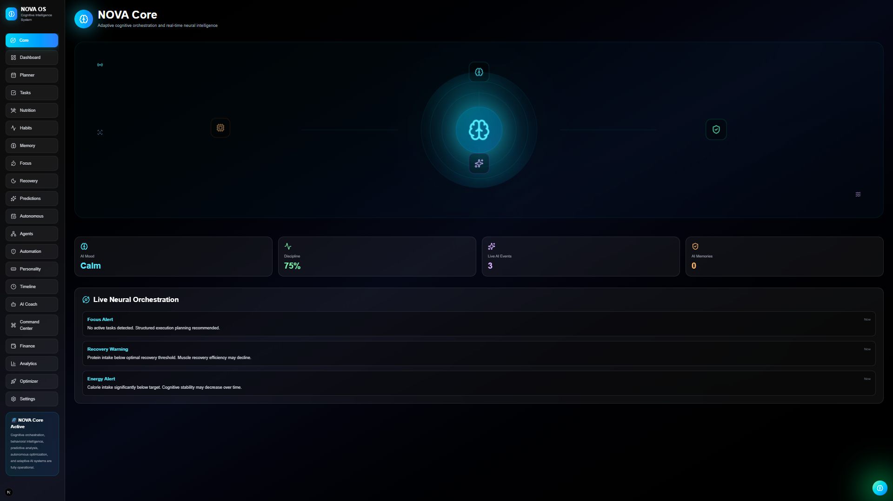
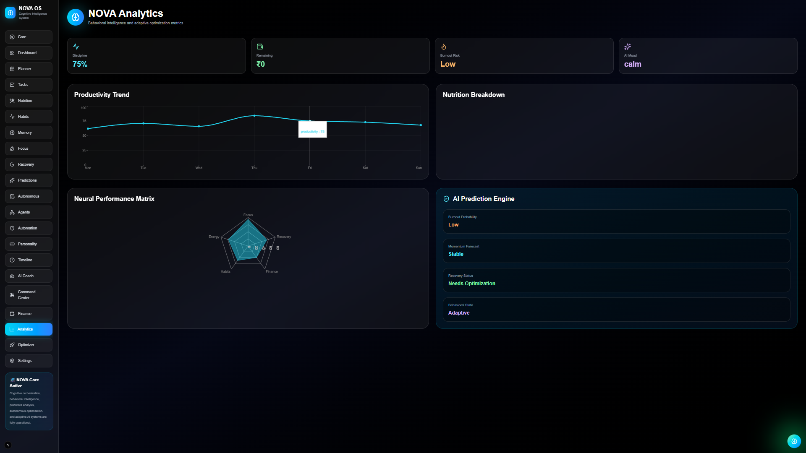
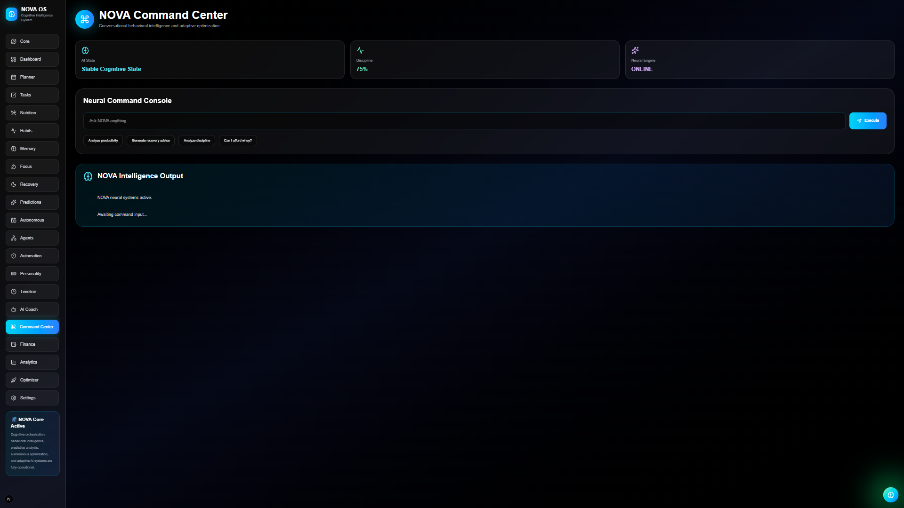
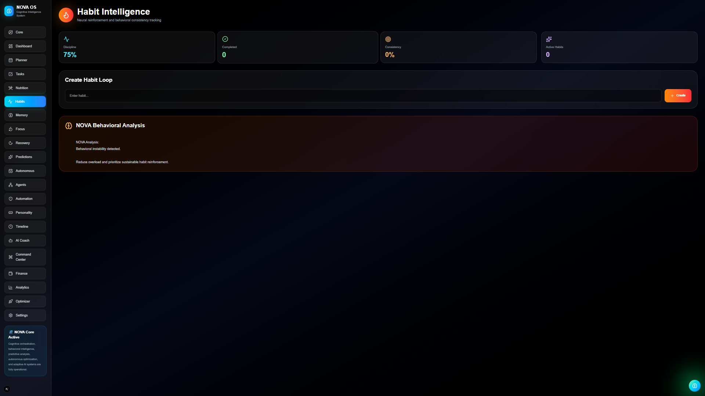
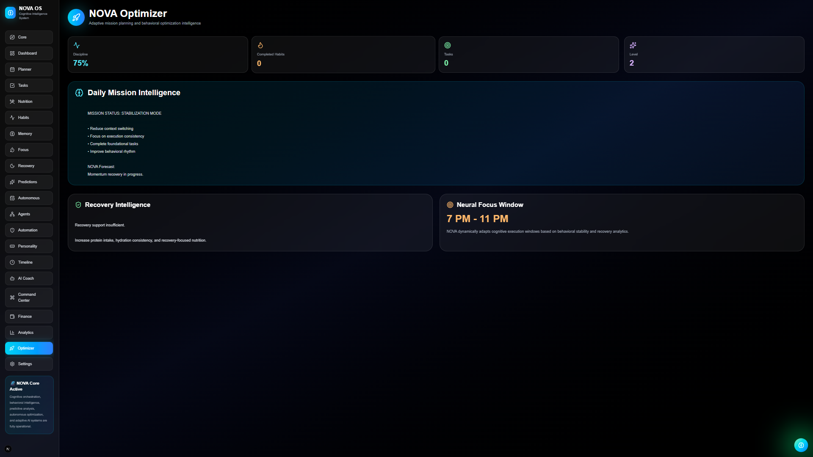

# 🧠 NOVA — AI Behavioral Operating System

> Adaptive intelligence for productivity, behavior, recovery, focus, nutrition, and life optimization.

---

# 🚀 Overview

NOVA is an AI-powered Behavioral Operating System designed to optimize human performance through intelligent behavioral analysis, adaptive planning, habit reinforcement, nutrition intelligence, financial analytics, and neural-inspired UI systems.

Unlike traditional productivity apps, NOVA focuses on:
- behavioral intelligence
- cognitive optimization
- discipline reinforcement
- adaptive recovery systems
- AI-driven life orchestration

---

# ✨ Core Features

## 🧠 NOVA Core Intelligence
- Neural AI visualization
- Adaptive AI states
- Behavioral analysis engine
- AI memory systems
- Dynamic intelligence feed

---

## 🚀 Command Center
- Conversational AI interface
- Smart optimization suggestions
- Recovery recommendations
- Productivity analysis
- Financial intelligence

---

## 📊 Neural Analytics
- Productivity analytics
- Nutrition breakdowns
- Discipline visualization
- Burnout prediction
- Recovery forecasting
- AI behavioral metrics

---

## 🔥 Habit Intelligence
- Habit streak tracking
- Consistency scoring
- Reinforcement systems
- Behavioral momentum tracking
- Neural reinforcement loops

---

## 🥗 Nutrition Intelligence
- AI-powered nutrition analysis
- Macro tracking
- Recovery optimization
- Budget-aware nutrition planning
- Meal intelligence engine

---

## 💰 Financial Intelligence
- Expense tracking
- Spending analytics
- Financial optimization
- Budget intelligence
- AI affordability analysis

---

## 🏆 Progression System
- XP engine
- Neural ranks
- Behavioral achievements
- Leveling systems
- Reinforcement psychology

---

## 🎯 NOVA Optimizer
- Daily mission generation
- Focus window prediction
- Recovery optimization
- Workload analysis
- Behavioral orchestration

---

# 🧩 System Architecture

```txt
NOVA OS
│
├── AI Core
├── Command Center
├── Neural Analytics
├── Habit Intelligence
├── Nutrition Intelligence
├── Financial Intelligence
├── Progression Engine
├── Behavioral Memory System
├── Recovery Engine
└── Optimization Layer
```

---

# ⚡ Tech Stack

## Frontend
- Next.js
- React
- TypeScript
- Tailwind CSS
- Framer Motion

## Visualization
- Recharts

## State Management
- React Context API

## Persistence
- LocalStorage Engine

## UI/UX
- Neural-inspired futuristic interface
- Glassmorphism
- Motion-driven interactions
- Dynamic AI visual systems

---

# 🧠 AI Systems

NOVA contains multiple adaptive AI engines:

- Behavioral Intelligence Engine
- Recovery Intelligence Engine
- Optimization Engine
- Neural Memory System
- AI Activity Feed
- Productivity Analysis Engine
- Habit Reinforcement Engine
- Progression Psychology System

---

# 📸 Screenshots

## 🧠 NOVA Core



---

## 📊 Neural Analytics



---

## 🚀 Command Center



---

## 🔥 Habit Intelligence



---

## 🏆 Progression System


---

## 🎯 NOVA Optimizer



---

# 🚀 Installation

## Clone Repository

```bash
git clone https://github.com/YOUR_USERNAME/nova-life-os.git
```

---

## Install Dependencies

```bash
npm install
```

---

## Start Development Server

```bash
npm run dev
```

---

# 🧠 Future Roadmap

- Voice AI System
- OpenAI Integration
- Autonomous AI Agents
- Smart Scheduling AI
- Wearable Integration
- AI Cognitive Prediction Models
- Real-Time AI Coaching
- Multi-Agent Intelligence Layer
- Cross-device Synchronization

---

# 🎨 Design Philosophy

NOVA is designed around the concept of:

> “An operating system for human optimization.”

The system combines:
- behavioral psychology
- AI intelligence
- productivity science
- cognitive optimization
- reinforcement psychology
- futuristic UI systems

into a single adaptive platform.

---

# 📈 Project Goals

- Build a real AI productivity ecosystem
- Create adaptive behavioral intelligence
- Improve execution consistency
- Reinforce healthy habits
- Optimize recovery and focus
- Create an immersive AI operating experience

---

# 👨‍💻 Author

Built by Ankush Patra

---

# ⭐ If You Like This Project

Star the repository and follow future NOVA development.
