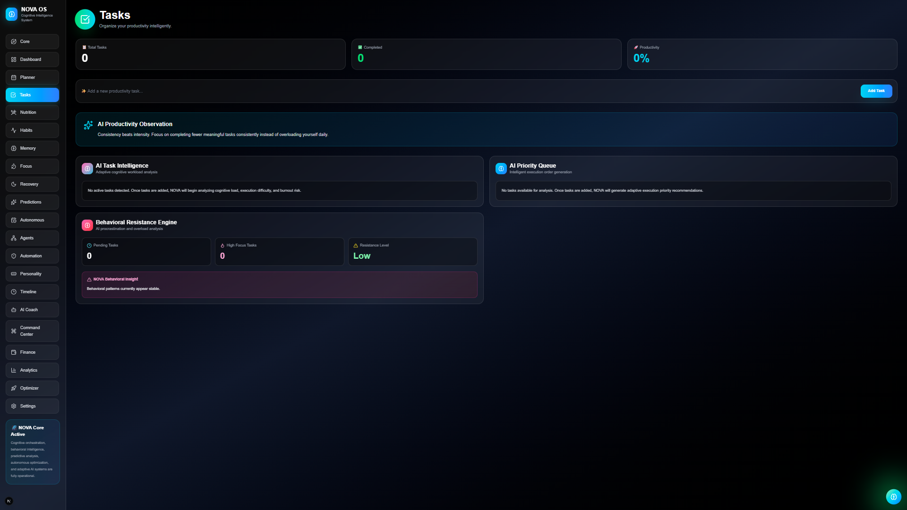

# 🧠 NOVA — AI Behavioral Operating System

> Adaptive intelligence for productivity, optimization, recovery, discipline, and behavioral evolution.

---

# 🚀 What is NOVA?

NOVA is a futuristic AI-powered Behavioral Operating System built to optimize human performance through:

- adaptive AI systems
- behavioral analytics
- productivity intelligence
- nutrition optimization
- financial tracking
- habit reinforcement
- progression psychology
- cognitive optimization

Unlike traditional productivity apps, NOVA focuses on:
# understanding and optimizing the HUMAN behind the workflow.

---

# ⚡ Core Philosophy

NOVA combines:

```txt
Artificial Intelligence
Behavioral Psychology
Productivity Science
Gamification Systems
Human Performance Analytics
Neural-inspired Interfaces
```

into one adaptive ecosystem.

---

# 🧠 NOVA Core Intelligence

The NOVA Core acts as the central neural intelligence system of the platform.

It dynamically adapts:
- AI personality
- behavioral analysis
- recovery state
- productivity momentum
- optimization logic

while visually simulating:
# a futuristic neural AI system.


---

# 📊 Neural Analytics Engine

The analytics engine visualizes:
- discipline trends
- recovery state
- nutrition metrics
- productivity patterns
- burnout prediction
- behavioral momentum

through immersive animated intelligence dashboards.


---

# 🚀 NOVA Command Center

The Command Center acts like a Jarvis-style AI interaction layer.

Users can:
- analyze productivity
- optimize recovery
- evaluate finances
- generate AI insights
- interact with adaptive intelligence systems

through conversational commands.


---

# 🔥 Habit Intelligence System

NOVA includes a behavioral reinforcement engine powered by:
- streak systems
- consistency analysis
- discipline reinforcement
- momentum tracking
- neural progression loops

designed to strengthen long-term execution consistency.


---

# ✅ Intelligent Task System

NOVA includes an adaptive task execution system designed for:
- high-focus productivity
- intelligent prioritization
- execution tracking
- cognitive workload management
- behavioral consistency

The task layer integrates directly with:
- AI optimization systems
- discipline analytics
- productivity intelligence
- behavioral reinforcement engines

allowing NOVA to dynamically analyze execution momentum and workflow stability.



---

# 🎯 NOVA Optimizer

The Optimizer dynamically generates:
- daily missions
- recovery strategies
- focus windows
- workload optimization
- execution recommendations

based on behavioral intelligence and performance analytics.


---

# 🧩 System Architecture

```txt
NOVA OS
│
├── AI Core
├── Behavioral Intelligence
├── Neural Analytics
├── Command Center
├── Habit Reinforcement
├── Nutrition Intelligence
├── Financial Intelligence
├── Progression Engine
├── Recovery Engine
└── Optimization Layer
```

---

# ⚡ Tech Stack

## Frontend
- Next.js
- React
- TypeScript
- Tailwind CSS
- Framer Motion

## Data Visualization
- Recharts

## State Management
- React Context API

## Persistence
- LocalStorage Architecture

## UI/UX
- Neural-inspired interfaces
- Glassmorphism
- Motion systems
- Futuristic dashboards
- Adaptive AI visuals

---

# 🧠 AI Systems Included

NOVA currently contains:

- Behavioral Intelligence Engine
- Optimization Engine
- Recovery Intelligence System
- AI Activity Feed
- Habit Reinforcement Engine
- Neural Progression System
- Productivity Intelligence Layer
- Financial Optimization Logic
- Nutrition Analysis Engine

---

# 🚀 Installation

## Clone Repository

```bash
git clone https://github.com/YOUR_USERNAME/nova-life-os.git
```

---

## Install Dependencies

```bash
npm install
```

---

## Run Development Server

```bash
npm run dev
```

---

# 🛣️ Future Roadmap

Upcoming systems planned for NOVA:

- Voice AI Assistant
- OpenAI Integration
- Autonomous AI Agents
- Smart Scheduling Engine
- AI Memory Expansion
- Wearable Device Sync
- AI Prediction Models
- Multi-Agent Intelligence
- Real-Time Coaching System

---

# 🎨 Design Direction

NOVA is heavily inspired by:
- futuristic operating systems
- neural interfaces
- cyberpunk aesthetics
- Jarvis-style AI systems
- immersive productivity experiences

with a strong focus on:
# human optimization through adaptive intelligence.

---

# 👨‍💻 Developer

Built by Ankush Patra

---

# ⭐ Support

If you like this project:
- Star the repository
- Follow future NOVA development
- Contribute ideas and improvements
